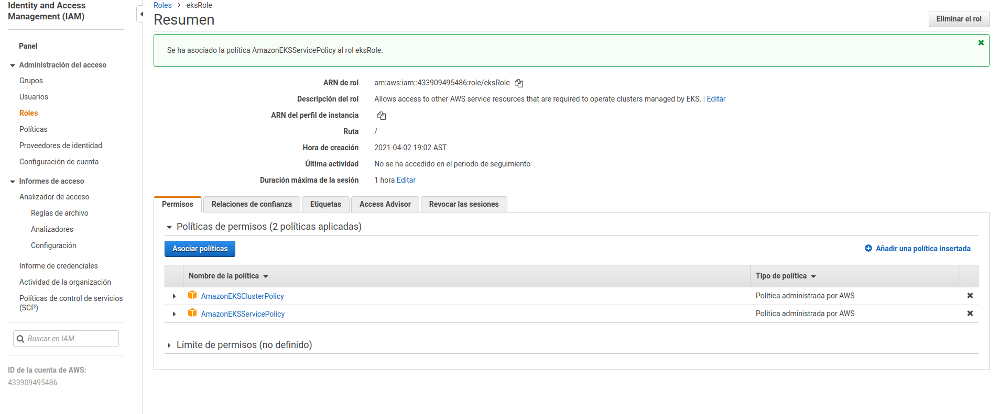
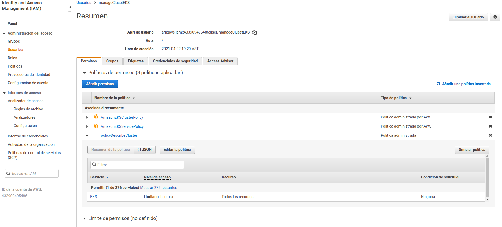

##### Concepts

##### Kubernetes

    Alias k8s

##### Concepts

 - Pod

A pod contains one or more containers, the most basic deployable objects in
kubernetes.

 - Deployment

A deployments provides declarative updates for Pods and ReplicaSets.

 - Node

Its job is to run pods. Each kubernetes node runs several Kubernetes components
such as the kubelet, the container runtime, and kube-proxy.

- Service

Is an abstraction which defines a logical sets of Pods and a policy by which
access them. The set of Pods targeted by a Service is usually determined by
a selector.

##### Creating EKS -SERVICE ROLE
 TWO POLICIES:
 
 - AmazonEKSClusterPolicy
 - AmazonEKSSservicePolicy

### Create user
  
  Create a policy to be attached to the user, which will be used for managing eks

   eks:DescribeCluster
  

https://docs.aws.amazon.com/eks/latest/userguide/create-kubeconfig.html

#### From GITHUB

https://s3.us-west-2.amazonaws.com/amazon-eks/cloudformation/2020-10-29/amazon-eks-vpc-private-subnets.yaml

#### After launching the cloudformation template

##### Create cluster 

    Use the service role
    Use the vpc from the template
    Select private and public

   - Create one EC2-instance in a public subnet, to be used to talk and configure
  the cluster 
  
  - Create and user with permission to manage eks-cluster [link](#create-user)
     
  - Log into that ec2, then
  
       Setting the credentials for the cli aws configure (accesskey,secretKey) [2
       
     Download kubectl

       curl -o kubectl https://amazon-eks.s3.us-west-2.amazonaws.com/1.19.6/2021-01-05/bin/linux/amd64/kubectl

    Set executable
  
       ec2@1221 chmod a+x ./kubectl
       ec2@1221 mkdir bin
       ec2@1221 cp ./kubectl $HOME/bin/kubectl
       ec2@1221 export PATH=$HOME/bin:$PATH
       ec2@2121 echo 'export PATH=$HOME/bin:$PATH' >> ~/.bashrc
    
    Download aws-iam-authenticator

      curl -o aws-iam-authenticator https://amazon-eks.s3.us-west-2.amazonaws.com/1.19.6/2021-01-05/bin/linux/amd64/aws-iam-authenticator

      chmod +x ./aws-iam-authenticator

      cp ./aws-iam-authenticator $HOME/bin/aws-iam-authenticator
    
   Associate iam with kubectl 

    aws eks update-kubeconfig --name eks-cluster

